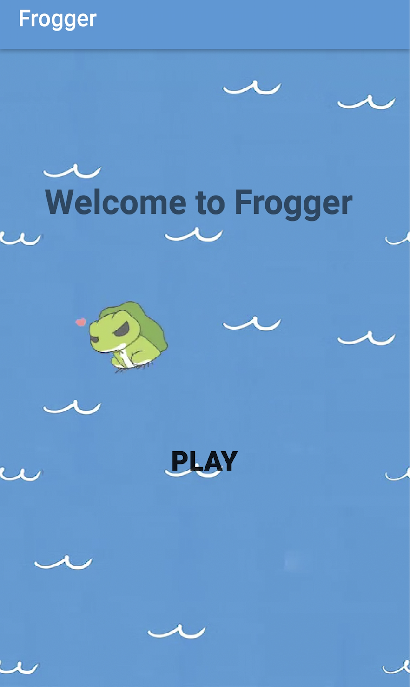
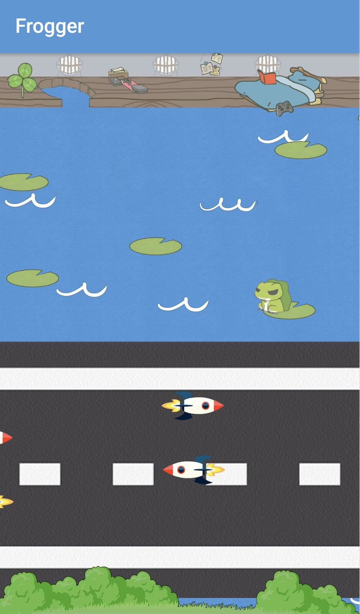

# Frogger

## Game Overview

_This frogger game is a puzzle game aimed at people 10 years old and above. It has a lovely flat cartoon
 design, with multiple sound effects. The main objective of the game is to get the frog back home through 
 difficulties, including going across a driveway full of cars, traveling across a river. If the frog is 
 hit by a running car or drops into the water, it will die. To add more challenge, the frog only has 3 lives,
 which is indicated by the number of cloves on the top left conner of the screen. After failing three times, game will 
 fail and jump to the finish page. Only successfully crossing the driveway and going across the river by 
 jumping between lotus and finally get back home and lying on bed means that the game wins._ 
 
 
 

### Inspiration

- The image design and UI design is derived from the [Travel Frog](http://www.hit-point.co.jp/games/tabikaeru/).
- The game logic is from the normal frogger game.

### Assets

+ BGM from Honkai Impact 3rd [Xia Ri Hui Yi](http://www.bilibili.com/video/av26185092)
+ Sound Effect from [Honkai Impact 3rd](http://www.global.honkaiimpact3.com/).
+ UI images editted from [Travel Frog](http://www.hit-point.co.jp/games/tabikaeru/).
